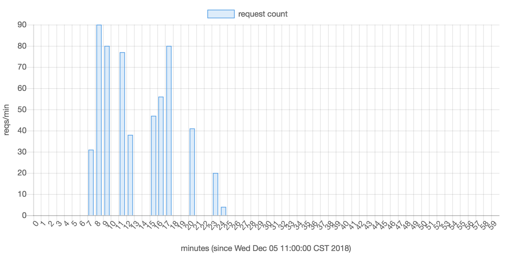
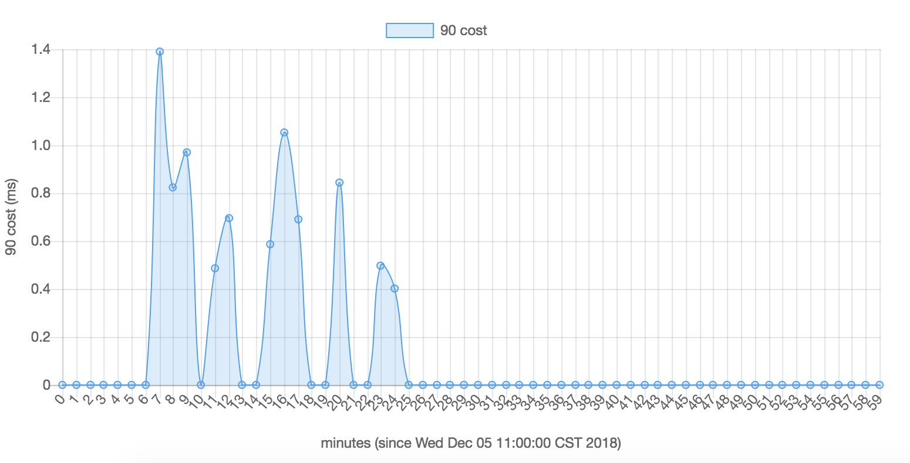

# webflux-metric-monitor-demo
metric monitor demo written with spring boot web-flux.

It records every request sent by the browser, and calculate the total count, qps, success rate, latency, percentile 90&99 cost and avg cost.

# usage
open monitor page(http://localhost:8080/) and refresh, you will see the charts.

# Reference
[spring boot](https://spring.io/projects/spring-boot)

[Charts.js](https://www.chartjs.org)
